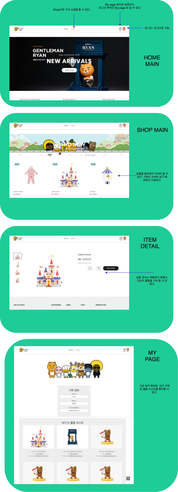

## My Kakao Shop project

- 간단한 사용 설명
- (https://github.com/KOOSANGYOON/myKakaoShop) git clone 혹은, 압축파일의 압축을 해제한 뒤,
- MyKakaoShopApplication 을 실행시킨다.
- 상품관련 파일들은 모두 전체 압축파일 안에 저장되어있다.
- h2 database 를 사용했다.

---
### 1. 사용 방법 (시나리오)

 

---
### 2. 추 후 수정 필요 부분

- 상품에 대한 설정이 매우 빈약하다. (사이즈나 카테고리 등의 추가 필요)
- 구매할 때, 갯수를 지정하여 저장할 수 있어야 한다.
- 결재 부분은 실제로 결재 api를 이용해서 구현해보자.
